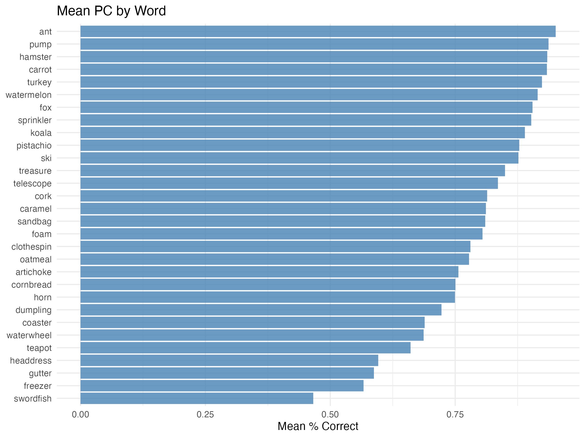
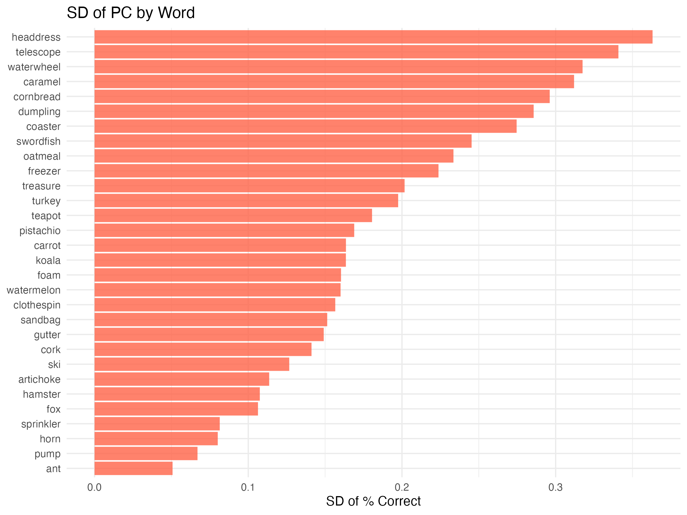
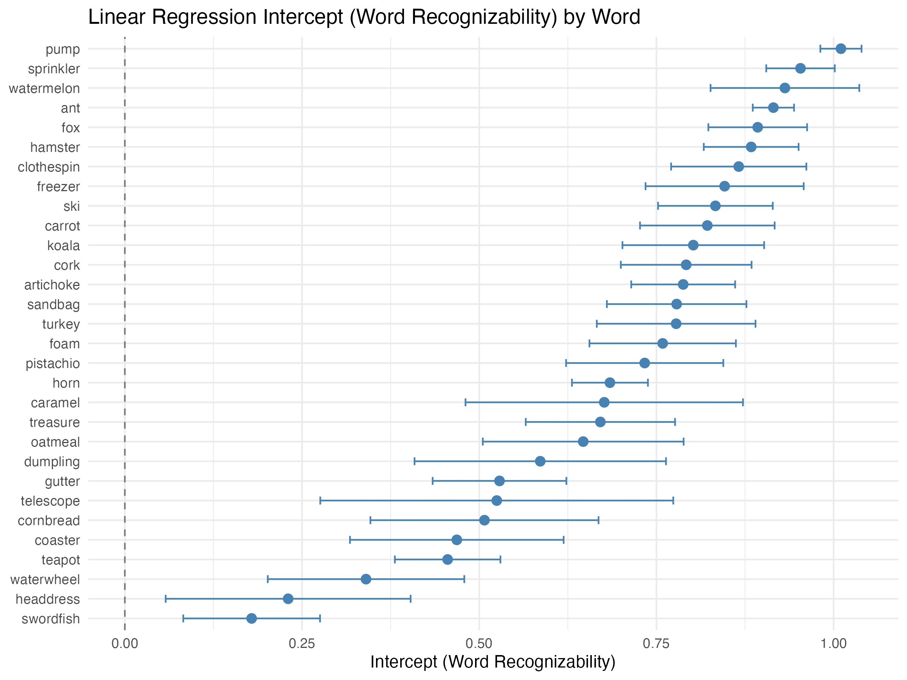
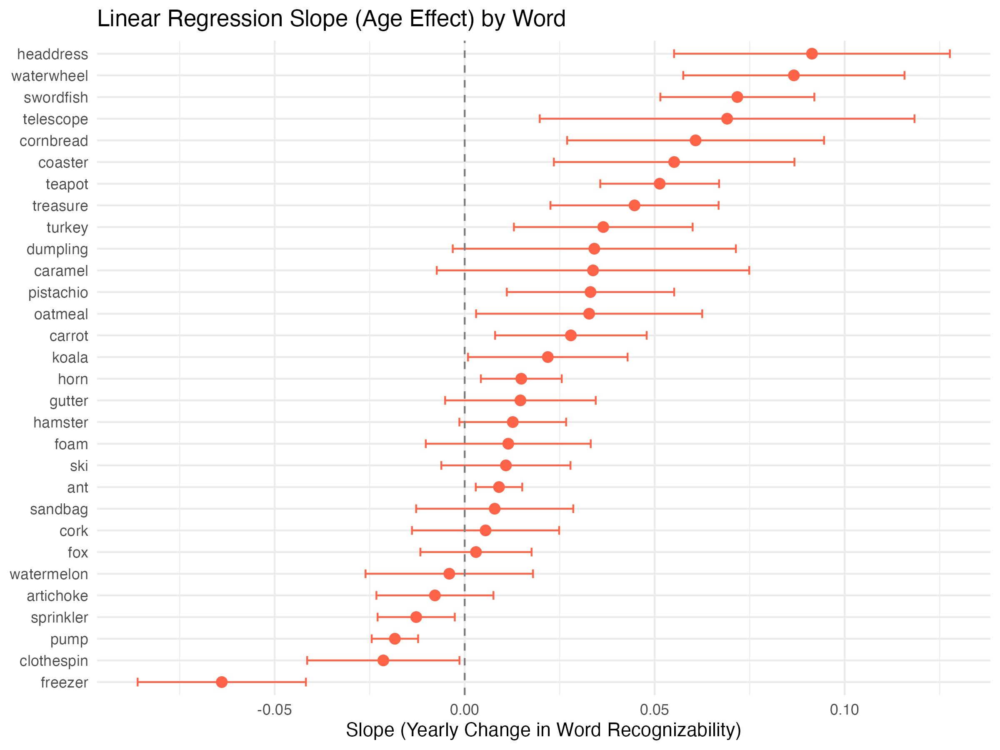

## 2-2. PC by Word

:::: {.columns}

::: {.column width="50%"}
**2-2-1. Mean PC by Word**

{width=100%}
:::

::: {.column width="50%"}
**2-2-2. SD of PC by Word**

{width=100%}
:::

::::

## 3. Word-level LM

:::: {.columns}

::: {.column width="50%"}
**3-1. Intercept**

{width=100%}
:::

::: {.column width="50%"}
**3-2. Slope**

{width=100%}
:::

::::
